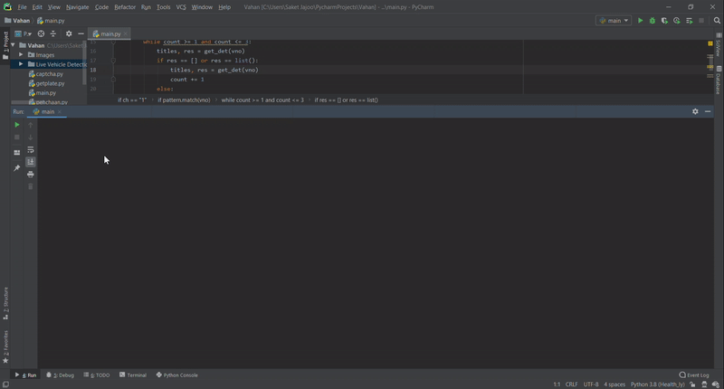

# Vaahan
A program to detect vehicle number plates and retrieve its details.

A user has 2 Options:    

1) To enter the vehicle number manually and get the details about the vehicle.  

</img>

  
2) To auto-detect the vehicle number from an image and get its details.  

</img>
  

</img>
  
